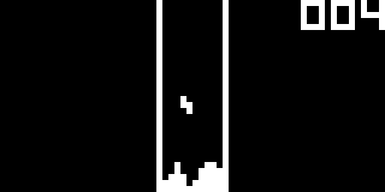

# CHIP-8 Emulator
This emulator is a unit tested C++ implementation of the CHIP-8 virtual machine.

It can play game ROMs designed for the CHIP-8 system!
### Invaders

### Tetris

## Dependencies
* SDL2
* Google Test
* Google Mock
## Usage
The emulator requires SDL2 which can be installed via your package manager:
```
sudo yum install SDL2-devel
```
The unit tests require Google Test and Google Mock. Both of these frameworks recommend that you do not install and link against them as pre-compiled libraries.
Therefore, if you wish to build the unit tests, you will need to get the sources for both of them and edit the appropriate directory variables in the Makefile.
### Emulator
```
make chip8
./chip8 [filename]
```
### Unit Tests
```
make chip8_test
./chip8_test
```
